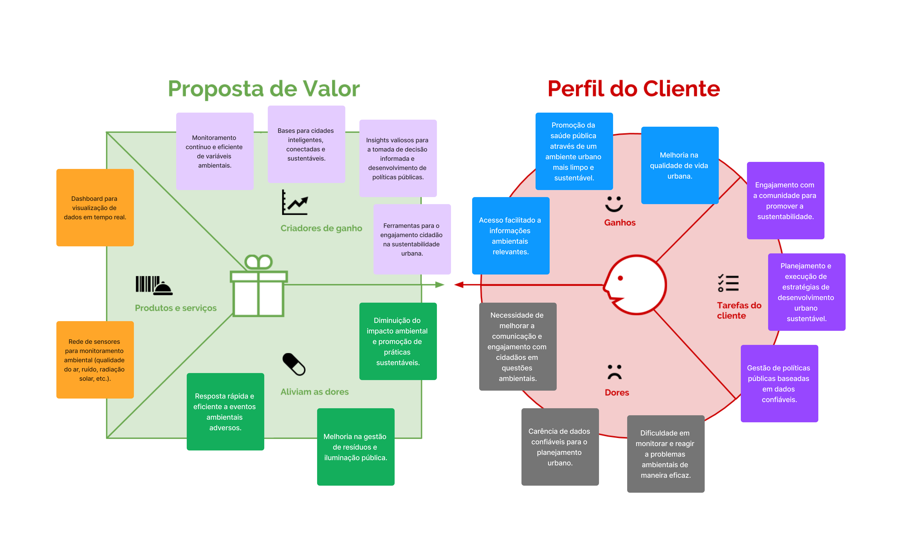

# Canvas Proposta de Valor

## Proposta de Valor

**Criadores de Ganhos**
- Bases para cidades inteligentes, conectadas e sustentáveis.
- Insights valiosos para a tomada de decisão informada e desenvolvimento de políticas públicas.
- Ferramentas para o engajamento cidadão na sustentabilidade urbana.

**Produtos e Serviços**
- Rede de sensores para monitoramento ambiental (qualidade do ar, ruído, radiação solar, etc.).
- Dashboard para visualização de dados em tempo real.

**Alívio das Dores**
- Diminuição do impacto ambiental e promoção de práticas sustentáveis.
- Melhoria na gestão de resíduos e iluminação pública.
- Resposta rápida e eficiente a eventos ambientais adversos.

## Perfil do Cliente

**Ganhos**
- Promoção da saúde pública através de um ambiente urbano mais limpo e sustentável.
- Acesso facilitado a informações ambientais relevantes.
- Melhoria na qualidade de vida urbana.

**Tarefas do Cliente**
- Gestão de políticas públicas baseadas em dados confiáveis.
- Planejamento e execução de estratégias de desenvolvimento urbano sustentável.
- Engajamento com a comunidade para promover a sustentabilidade.

**Dores**
- Dificuldade em monitorar e reagir a problemas ambientais de maneira eficaz.
- Carência de dados confiáveis para o planejamento urbano.
- Necessidade de melhorar a comunicação e engajamento com cidadãos em questões ambientais.
