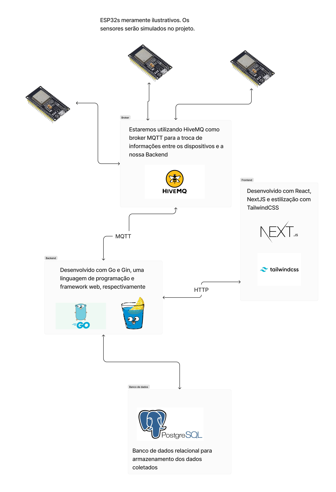

# Descrição da arquitetura



## Visão Geral

Este documento descreve a arquitetura de software para o sistema de IoT desenvolvido, incluindo a simulação de sensores, a comunicação entre dispositivos e o backend, e a interface do usuário.

### Sensores

- **ESP32s**: Usados meramente para fins ilustrativos. Os sensores serão simulados no projeto.

### Comunicação

- **HiveMQ**: Atua como broker MQTT para a troca de informações entre os dispositivos e o backend do sistema.

### Frontend

- **React**: Biblioteca JavaScript para construir interfaces de usuário.
- **Next.JS**: Framework React para renderização no lado do servidor e geração de sites estáticos.
- **TailwindCSS**: Framework CSS para design rápido e responsivo.

### Backend

- **Go**: Linguagem de programação estática, compilada e com tipagem forte.
- **Gin**: Framework web escrito em Go que fornece um método para rapidamente construir aplicações web robustas.

### Banco de Dados

- **PostgreSQL**: Sistema de gerenciamento de banco de dados relacional para armazenamento dos dados coletados.

## Arquitetura Detalhada

```plaintext
[Sensores (ESP32s)] --MQTT--> [Broker (HiveMQ)] --MQTT--> [Backend (Go & Gin)] --HTTP--> [Frontend (React, Next.js, TailwindCSS)]
                                                                  |
                                                                  v
                                                         [Banco de Dados (PostgreSQL)]
```

## Fluxo de Dados

1. Os sensores simulados (ESP32s) publicam dados usando o protocolo MQTT.
2. O broker MQTT (HiveMQ) recebe e distribui as mensagens.
3. O backend desenvolvido em Go com o framework Gin processa os dados e interage com o banco de dados.
4. O frontend, criado com React e Next.js e estilizado com TailwindCSS, apresenta os dados processados aos usuários.

## Considerações Finais

A arquitetura foi projetada para garantir a escalabilidade e a eficiência na comunicação entre os componentes do sistema, fornecendo uma experiência de usuário suave e reativa.
