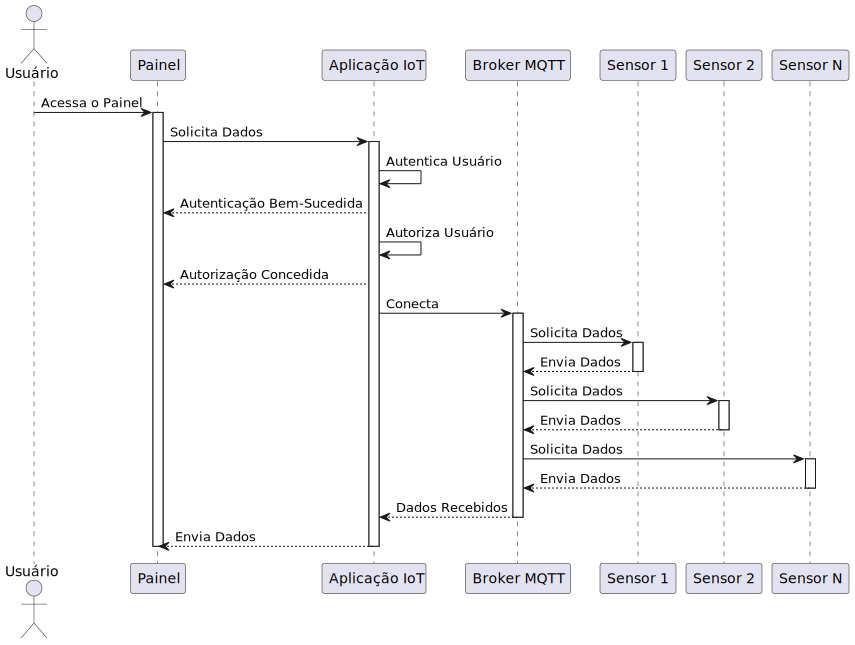
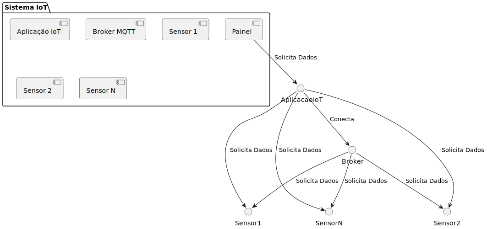

# Diagrama UML de sequência e implantação

Nessa seção são apresentadas as interações detalhadas entre os diferentes componentes do sistema proposto, incluindo os dispositivos de hardware multimodais, a plataforma web de engajamento do cidadão e o dashboard de gerenciamento de dados. Esse diagrama oferece uma visão clara da dinâmica de comunicação entre esses elementos, bem como sua distribuição física nos ambientes urbanos. Ao representar as sequências de eventos entre os sensores, a plataforma web e o sistema de gerenciamento, o diagrama fornece uma base sólida para o planejamento e implementação das soluções propostas, contribuindo significativamente para a compreensão e o desenvolvimento eficaz do projeto.

## Diagrama UML de sequência

Esse diagrama oferece uma representação das interações entre o usuário e o painel de controle, elucidando o processo de solicitação de dados à aplicação IoT. A validação e concessão de acesso aos usuários autorizados são explicitadas, demonstrando a funcionalidade de autenticação e autorização da aplicação. Além disso, o diagrama retrata de forma clara a troca de informações entre a aplicação IoT e o broker MQTT, que desempenha um papel central na obtenção de dados dos sensores distribuídos. A sequência de interações entre o broker e os sensores, assim como a transmissão de dados de volta à aplicação IoT, é apresentada de maneira lógica e compreensível.



```
@startuml
actor Usuário
participant "Painel" as Painel
participant "Banco de dados" as Database
participant "Consumidor em GO" as GOConsumer
participant "Broker MQTT e RabbitMQ" as Broker
participant "Sensor 1" as Sensor1
participant "Sensor 2" as Sensor2
participant "Sensor N" as SensorN

Usuário -> Painel: Acessa o Painel
activate Painel

activate GOConsumer
Painel -> Painel: Autentica Usuário
Painel -> Painel: Autoriza Usuário
Painel --> Painel: Autorização Concedida
Painel -> Database: Solicita Dados

GOConsumer -> Database: Conecta
GOConsumer -> Broker: Conecta

activate Broker
Sensor1 --> Broker: Conexão
activate Sensor1
Sensor1 --> Broker: Envia Dados
deactivate Sensor1
Sensor2 --> Broker: Conexão
activate Sensor2
Sensor2 --> Broker: Envia Dados
deactivate Sensor2
SensorN --> Broker: Conexão
activate SensorN
SensorN --> Broker: Envia Dados

Broker -> GOConsumer: Recebe dados
deactivate SensorN
GOConsumer --> Database: Salva Dados


Database -> Painel: Envia Dados
deactivate Broker
deactivate Painel
deactivate GOConsumer
deactivate Database
@enduml


```

No Diagrama UML de sequência acima, um usuário acessa um painel de controle, que olicita dados a uma aplicação de Internet das Coisas (IoT). Essa aplicação autentica o usuário, concedendo acesso ao painel após a autenticação bem-sucedida. Em seguida, a aplicação autoriza o usuário e se conecta a um broker MQTT, que é responsável por gerenciar a comunicação entre os diversos sensores e a aplicação. O broker envia solicitações aos sensores, como Sensor 1, Sensor 2 e Sensor N, que respondem enviando os dados solicitados de volta ao broker. Finalmente, o broker envia os dados recebidos de volta à aplicação IoT, que os envia ao painel de controle para serem exibidos. Este processo é desencadeado pela interação inicial do usuário com o painel e continua até a transmissão dos dados de volta ao painel para exibição.

## Diagrama UML de implantação

O Diagrama de UML de implantação discrima a distribuição dos componentes do sistema em um ambiente real de implementação de software, representando os elementos como nós de implantação. Aqui, são destacado as o painel de controle, a aplicação IoT, o broker MQTT e os sensores, identificando suas interações e a forma como estão dispostos no ambiente físico. O diagrama de implantação fornece uma visão da infraestrutura de aplicações de software e hardware necessárias para o funcionamento do sistema, auxiliando no planejamento e compreensão da distribuição dos componentes em sua implementação por uma equipe de desenvolvimento.



```
@startuml
package "Sistema IoT" {
    [Painel]
    [Aplicação IoT]
    [Broker MQTT]
    [Sensor 1]
    [Sensor 2]
    [Sensor N]
}

Painel --> AplicacaoIoT: Solicita Dados
AplicacaoIoT --> Broker: Conecta
AplicacaoIoT --> Sensor1: Solicita Dados
AplicacaoIoT --> Sensor2: Solicita Dados
AplicacaoIoT --> SensorN: Solicita Dados
Broker --> Sensor1: Solicita Dados
Broker --> Sensor2: Solicita Dados
Broker --> SensorN: Solicita Dados
@enduml

```
