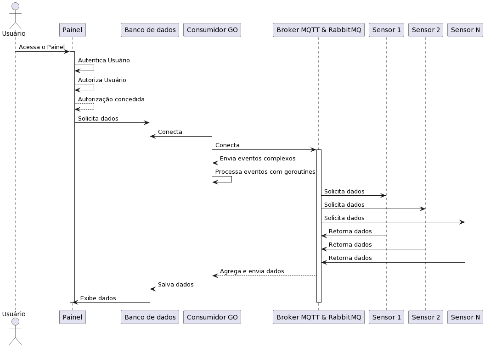
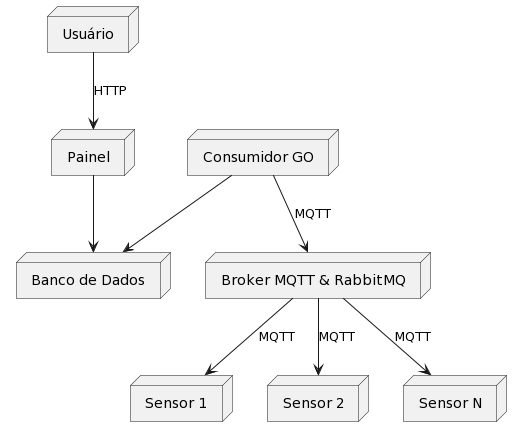

# Diagrama UML de sequência e implantação

Nessa seção são apresentadas as interações detalhadas entre os diferentes componentes do sistema proposto, incluindo os dispositivos de hardware multimodais, a plataforma web de engajamento do cidadão e o dashboard de gerenciamento de dados. Esse diagrama oferece uma visão clara da dinâmica de comunicação entre esses elementos, bem como sua distribuição física nos ambientes urbanos. Ao representar as sequências de eventos entre os sensores, a plataforma web e o sistema de gerenciamento, o diagrama fornece uma base sólida para o planejamento e implementação das soluções propostas, contribuindo significativamente para a compreensão e o desenvolvimento eficaz do projeto.

## Diagrama UML de sequência

Esse diagrama oferece uma representação das interações entre o usuário e o painel, elucidando o processo de solicitação de dados a uma aplicação em GO. O método de solicitação e concessão de acesso aos usuários autorizados são explicitados, demonstrando a funcionalidade de autenticação e autorização da aplicação. Além disso, o diagrama retrata de forma clara a troca de informações entre o consumidor GO e o Broker MQTT/RabbitMQ, que desempenha um papel central na obtenção de dados dos sensores IoT. A sequência de interações entre o broker e os sensores, assim como a transmissão de dados de volta a consumidor GO, bem como seu armazenamento em um banco de dados, é apresentada no diagrama abaixo.



### Diagrama UML de sequência em PlantUML

```
@startuml
actor Usuário
participant "Painel" as Painel
participant "Banco de dados" as Banco
participant "Consumidor GO" as CGO
participant "Broker MQTT & RabbitMQ" as Broker
participant "Sensor 1" as Sensor1
participant "Sensor 2" as Sensor2
participant "Sensor N" as SensorN

Usuário -> Painel: Acessa o Painel
activate Painel
activate CGO
Painel -> Painel: Autentica Usuário
Painel -> Painel: Autoriza Usuário
Painel --> Painel: Autorização concedida
Painel -> Banco: Solicita dados
CGO -> Banco: Conecta
CGO -> Broker: Conecta
activate Broker
Sensor1 --> Broker: Conecta
activate Sensor1
Sensor1 --> Broker: Envia Dados
deactivate Sensor1
Sensor2 --> Broker: Conecta
activate Sensor2
Sensor2 --> Broker: Envia Dados
deactivate Sensor2
SensorN --> Broker: Conecta
activate SensorN
SensorN --> Broker: Envia Dados
deactivate SensorN
Broker --> CGO: Recebe dados
CGO --> Banco: Salva dados
Banco -> Painel: Envia dados
deactivate Broker
deactivate CGO
deactivate Painel
@enduml
```

No Diagrama UML de sequência acima, um usuário acessa o painel de controle do sistema. Em seguida, o painel realiza a validação das credenciais do usuário, autenticando-o no sistema. Após a autenticação, o sistema verifica as permissões do usuário e autoriza o acesso. Uma vez autorizado, o usuário solicita dados ao sistema, que são recuperados do banco de dados. O Consumidor GO (CGO) é ativado para processar essa solicitação. Ele estabelece conexões tanto com o banco de dados quanto com o broker MQTT & RabbitMQ. O broker MQTT & RabbitMQ age como um intermediário na comunicação entre o Consumidor GO e os sensores IoT distribuídos no ambiente físico, aqui representados como Sensor 1, Sensor 2 e Sensor N). Cada sensor envia dados ao broker quando solicitado. Após receber os dados dos sensores, o broker os transmite de volta ao Consumidor GO. O Consumidor GO então os salva no banco de dados para armazenamento e futura recuperação mediante a uma requisição de um usuário autenticado e autorizado pelo próprio painel, fechando o ciclo de interações.

## Diagrama UML de implantação

O Diagrama de UML de implantação discrima a distribuição dos componentes do sistema em um ambiente real de implementação de software, representando os elementos como nós de implantação e os respectivos métodos de comunicação entre si. Aqui, são destacados o usuário, o painel de controle, o banco de dados, o consumidor GO, o broker MQTT & RabbitMQ e os sensores, ilustrando como esses elementos se conectam e comunicam entre si. Essa representação visual oferece uma visão geral da distribuição dos componentes e da infraestrutura necessária para o funcionamento do sistema, facilitando o planejamento e a implementação por parte da equipe de desenvolvimento. 



### Diagrama UML de implantação em PlantUML

```
@startuml
node "Usuário" as User

node "Painel" as Panel
node "Banco de Dados" as Database
node "Consumidor GO" as GOConsumer
node "Broker MQTT & RabbitMQ" as MQTTBroker
node "Sensor 1" as Sensor1
node "Sensor 2" as Sensor2
node "Sensor N" as SensorN

User --> Panel : HTTP
Panel --> Database
Panel --> GOConsumer : HTTP
GOConsumer --> Database 
GOConsumer --> MQTTBroker : MQTT
MQTTBroker --> Sensor1 : MQTT
MQTTBroker --> Sensor2 : MQTT
MQTTBroker --> SensorN : MQTT

@enduml
```
