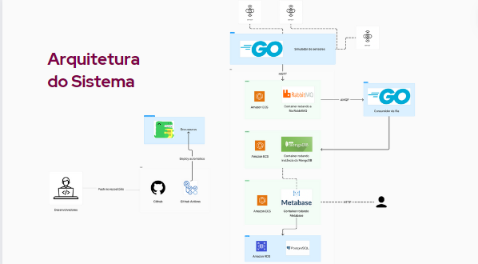

# Descrição da arquitetura



## Visão Geral

Este documento descreve a arquitetura de software para o sistema de IoT desenvolvido, incluindo a simulação de sensores, a comunicação entre dispositivos e o backend, e a interface do usuário.

### Sensores

- **ESP32s**: Usados meramente para fins ilustrativos. Os sensores serão simulados no projeto. A sua simulação consiste em basicamente gerar valores que se encontram em seu "range" de atuação e publicá-los em um tópico MQTT.

### Comunicação

- **RabbitMQ**: Atua como um gerenciador de fila e broker MQTT (ele já enfileira as mensagens vidas de um tópico). Seu sistema nos permite trazer segurança a aplicação, posto que temo a possibilidade nativamente de gerenciar o acesso aos recuros, tais qual quais usuários podem publicar em quais tópicos MQTT.

### Frontend

- **Metabase**: Ferramenta consolidada no mercado que nos permite criar dashboards facilmente.

### Backend

- **Go**: Linguagem de programação estática, compilada e com tipagem forte.

### Banco de Dados

- **PostgreSQL**: Sistema de gerenciamento de banco de dados relacional para armazenamento dos dados coletados.

## Arquitetura Detalhada

```plaintext
[Sensores (ESP32s simulados)] --MQTT--> [Broker (RabbitMQ)] --AMQP--> [Backend (Go)]  [Frontend (Metabase)]
                                                                          |                 ^
                                                                          v                 |
                                                         [Banco de Dados (PostgreSQL)]  <----
```

## Fluxo de Dados

1. Os sensores simulados (ESP32s) publicam dados usando o protocolo MQTT.
2. O broker MQTT recebe e enfileira as mensagens.
3. O backend desenvolvido em Go consome as mensagens, processa os dados e interage com o banco de dados para realizar os registros.
4. O Metabase faz requisições ao banco de dadaos e apresenta os dados processados aos usuários.

## Considerações Finais

A arquitetura foi projetada para garantir a escalabilidade e a eficiência na comunicação entre os componentes do sistema, fornecendo uma experiência de usuário suave e reativa.
