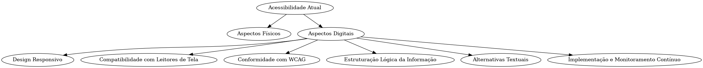

# 2. Avaliação de Acessibilidade Atual

No âmbito do "Planejamento de Hiperconectividade para Cidades Inteligentes", a acessibilidade atual é um aspecto crucial para garantir que as soluções tecnológicas sejam efetivamente inclusivas. Neste cenário progressista, a cidade de São Paulo, através da iniciativa UrbanPulseSP, proposta pelo Grupo 3 em colaboração com a PRODAM, se empenha na criação de um sistema avançado para a visualização e interpretação de dados provenientes de sensores através da plataforma Metabase. Esta proposta sublinha o compromisso em refinar e expandir as dimensões da acessibilidade, abrangendo tanto os domínios físicos quanto os digitais, para cultivar um ambiente urbano onde a tecnologia serve como ponte para a inclusão de todos os cidadãos.

## a. Aspectos físicos: Como são as entradas, saídas, mobilidade interna e sinais/comunicação.

Para enriquecer o entendimento dos aspectos físicos de acessibilidade em São Paulo, especialmente no contexto do projeto UrbanPulseSP e similares, é vital detalhar como essas normativas e práticas se aplicam no dia a dia, transformando a teoria em realidade tangível para as pessoas com deficiência.

Sob a norma NBR 9050, a cidade tem adotado um conjunto de medidas para aperfeiçoar a acessibilidade em ambientes urbanos. Por exemplo, as entradas e saídas das edificações públicas e privadas, assim como os espaços de circulação interna, estão sendo projetados ou reformados para incluir rampas de acesso com inclinação adequada, portas com largura suficiente para a passagem de cadeiras de rodas, e corrimãos e piso tátil para auxiliar na locomoção de pessoas com deficiência visual ou mobilidade reduzida.

Além disso, a sinalização em ambientes urbanos vem sendo revista para incorporar elementos que atendam a todas as necessidades. Isso inclui a implementação de sistemas de sinalização visual, tátil e sonora, que não só indicam as direções a serem seguidas, como também fornecem informações detalhadas sobre os serviços e facilidades disponíveis no local. Em pontos de interesse público, como estações de metrô, terminais de ônibus e prédios governamentais, a instalação de placas em Braille e o uso de avisos sonoros são medidas cada vez mais comuns para garantir a autonomia de pessoas com deficiência visual ou auditiva.

No que tange à mobilidade interna, a adequação de espaços públicos e privados passa pela instalação de elevadores acessíveis, escadas e rampas que atendam às especificações de segurança e conforto. Os elevadores, por exemplo, são equipados com botões em Braille e avisos sonoros indicando os andares, além de dimensões que permitem a acomodação confortável de cadeiras de rodas.

Para o projeto UrbanPulseSP, especificamente, a acessibilidade física nos locais de instalação dos sensores e equipamentos é uma prioridade. A localização estratégica desses dispositivos garante que seu acesso para manutenção e monitoramento seja viável para profissionais com diversas capacidades. Isso implica na seleção criteriosa dos locais de instalação, de forma a evitar obstáculos físicos que possam dificultar o acesso.

Em última análise, a integração de práticas de acessibilidade física nos projetos de infraestrutura urbana não só cumpre com as exigências legais, mas também promove uma cidade mais inclusiva e acolhedora. O compromisso de São Paulo com a implementação dessas normativas reflete um esforço contínuo em garantir que todos os cidadãos, independentemente de suas limitações ou capacidades, tenham igual acesso e oportunidades na sociedade.

## b. Aspectos digitais: Avaliação de plataformas ou sistemas associados (compatibilidade com leitores de tela, design responsivo, etc.).

A avaliação dos aspectos digitais de acessibilidade foca na usabilidade de plataformas e sistemas, incluindo a compatibilidade com leitores de tela, design responsivo, e a conformidade com os padrões de acessibilidade Web, especificamente as diretrizes WCAG (Web Content Accessibility Guidelines). Para o projeto UrbanPulse, desenvolvido no Metabase para a visualização de dados dos sensores, é imperativo que a interface do usuário esteja alinhada com essas diretrizes, garantindo que pessoas com deficiências visuais, auditivas, motoras ou cognitivas possam acessar e interpretar os dados apresentados sem barreiras.

### **1. Design Responsivo e Compatibilidade com Leitores de Tela**

A eficácia de uma plataforma digital em ser acessível está intrinsecamente ligada à sua capacidade de se adaptar a uma variedade de dispositivos e tamanhos de tela, bem como à sua compatibilidade com tecnologias assistivas, como leitores de tela. No contexto do projeto UrbanPulseSP, isso significa que a interface do Metabase deve ser meticulosamente projetada para garantir que todos os elementos da página sejam acessíveis e funcionais, independentemente do dispositivo utilizado pelo usuário.

Além disso, a compatibilidade com leitores de tela é fundamental para possibilitar que usuários com deficiência visual naveguem e interajam com a plataforma. Isso implica na implementação de atributos ARIA (Accessible Rich Internet Applications) para melhorar a semântica de elementos não convencionais da web e fornecer descrições textuais para conteúdos visuais, permitindo que os leitores de tela interpretem e comuniquem essas informações aos usuários de forma eficaz.

### **2. Conformidade com as Diretrizes WCAG**

A conformidade com as Diretrizes de Acessibilidade para Conteúdo Web (WCAG) é um pilar central para a acessibilidade digital. Estas diretrizes são divididas em três níveis de conformidade: A, AA e AAA. Para o UrbanPulseSP, visar pelo menos a conformidade no nível AA é crucial, cobrindo aspectos como contraste de cores adequado, navegação acessível por teclado, legendas para conteúdos de áudio e vídeo, e clareza na linguagem.

É importante que a equipe de desenvolvimento realize testes regulares de acessibilidade, utilizando tanto ferramentas automatizadas quanto avaliações manuais, para identificar e corrigir possíveis barreiras de acesso. Além disso, feedback direto de usuários com deficiências pode fornecer insights valiosos sobre como melhorar a usabilidade da plataforma.

Estruturação Lógica da Informação e Alternativas Textuais
A estruturação lógica da informação é essencial para a acessibilidade, assegurando que o conteúdo seja compreendido facilmente e esteja organizado de forma intuitiva. Isso inclui o uso adequado de cabeçalhos, listas e outros elementos estruturais que facilitam a navegação e compreensão do site.

A oferta de alternativas textuais para imagens, vídeos e outros conteúdos não textuais é outro aspecto crítico, permitindo que usuários com deficiências visuais ou auditivas recebam a mesma informação veiculada por meios visuais ou auditivos.

### **3. Implementação e Monitoramento Contínuo**

A acessibilidade digital não é um estado, mas um processo contínuo de melhoria. Isso significa que o projeto UrbanPulseSP deve incorporar a acessibilidade desde o início do desenvolvimento e continuar a monitorar e atualizar a plataforma para atender às necessidades emergentes dos usuários e às novas diretrizes de acessibilidade.

A Prefeitura de São Paulo, ao seguir e promover práticas recomendadas de acessibilidade digital em seus sites e sistemas, estabelece um forte precedente para projetos futuros. Alinhando-se a estas práticas, o UrbanPulseSP não apenas cumprirá com requisitos legais e éticos, mas também reforçará o compromisso da cidade com a inclusão digital, garantindo que todas as pessoas, independentemente de suas habilidades, possam se beneficiar das inovações tecnológicas implementadas em prol de uma cidade inteligente e conectada.

*Figura 1: Estrutura de Acessibilidade Digital para o Projeto UrbanPulseSP - Descreve os componentes-chave e as inter-relações na implementação da acessibilidade digital no sistema UrbanPulseSP.*

## Conclusão

A integração de considerações de acessibilidade física e digital no planejamento de hiperconectividade para cidades inteligentes, como São Paulo, é essencial para construir um ambiente urbano inclusivo. O projeto UrbanPulseSP, desenvolvido no Metabase para a PRODAM, representa um passo adiante na direção de uma cidade mais conectada e acessível. Através de avaliações contínuas e a implementação de melhorias baseadas nas normativas e diretrizes de acessibilidade, São Paulo pode se tornar um modelo de inclusão e inovação urbana.