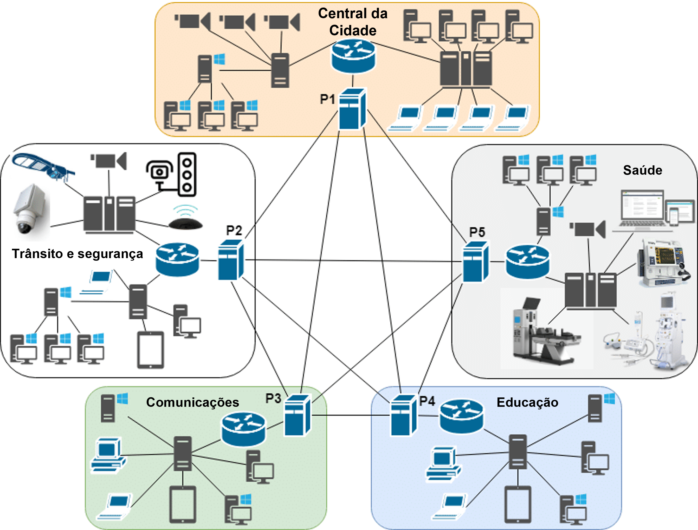

# 3. Planejamento de Hiperconectividade

Para este tópico, é importante salientar três principais fatores importantes para o desenvolvimento e planejamento de hiperconectividade para uma cidade inteligente. Ou seja, primeiramente, como serão integrados os diferentes sistemas? Segundo, e como o IOT (Internet Of Things) e os dispositivos poderiam ser integrados? E, terceiro, como seria uma infraestrutura para suportar a hiperconectividade, no caso das redes e comunicação?"

## Integração de Sistemas

De ínicio, deve-se entender que para hiperconectividade, o sistema deve ter uma ótima integração entre si, pois é nessa convergênica de diferentes tecnologias é que visa aprimoração da eficiência, segurança e experiência dos cidadãos. Ter uma rede coesa de sistemas urbanos é  garantir uma gestão mais eficaz e sustentável do ambiente urbano. Um exemplo prático de integração de sistemas pode ser observado na gestão do tráfego urbano, pois ao unir sistemas de monitoramento de tráfego, semáforos inteligentes e informações em tempo real sobre condições de trânsito, uma cidade pode otimizar o fluxo de veículos, reduzir congestionamentos e minimizar o tempo de deslocamento dos cidadãos. Ou também, por exemplo, se unir sistemas de monitoramento de poluentes atmosféricos, sensores de qualidade do ar em locais estratégicos e informações em tempo real sobre os níveis de poluição, uma cidade pode implementar medidas proativas para reduzir a exposição dos cidadãos a substâncias nocivas, promovendo assim a saúde pública e a qualidade de vida na sociedade. Esse é o projeto EcoVigilancia para PRODAM-SP.

Outrossim, outros benefícios chave da integração dos sistemas são as melhorias da eficiência operacional e a otimização. Por exemplo, ao integrar sistemas de transporte público, tráfego e estacionamento, uma cidade pode reduzir congestionamentos, melhorar o fluxo de tráfego e aumentar a disponibilidade de estacionamento. Da mesma forma, a integração de sistemas de iluminação pública, segurança e monitoramento pode melhorar a segurança nas ruas e espaços públicos.

No entanto, apesar dos planejamentos de como e o porquê da interconexão dos sistemas, um dos principais desafios enfrentados pelas cidades modernas é essa fragmentação deles e dos serviços, ou seja, cada um operando de forma independente e muitas das vezes sem comunicação entre si. A integração de sistemas visa superar essa fragmentação, criando uma infraestrutura tecnológica que permite a troca de dados e informações entre os diferentes setores urbanos.

Além disso, ao planejar a integração desses sistemas para uma cidade inteligente, é crucial identificar os sistemas existentes e determinar como eles podem ser unificados em uma rede coesa. Isso pode envolver a adoção de protocolos de comunicação padronizados, como MQTT (Message Queuing Telemetry Transport), que oferecem eficiência na troca de mensagens entre dispositivos e servidores na Internet das Coisas (IoT), por exemplo, e também a implementação de plataformas de integração  na infraestrutura de nuvem, como a AWS, que  pode facilitar a operabilidade entre os sistemas. Isso ajuda fornecer a escalabilidade e segurança para o processamento e armazenamento de dados.

Nesse contexto de segurança, outra parte essencial é garantir que os dados transmitidos e armazenados estejam protegidos contra ameaças cibernéticas. Mas, isso pode ser alcançado por meio de práticas de criptografia e autenticação robustas, bem como o estabelecimento de políticas de segurança e acesso. A utilização de processos seguros na AWS, como o IAM (Identity and Access Management) e a configuração adequada de permissões de acesso, é o básico para proteger os sistemas contra invasões e violações de segurança.

Só ressaltando que, no projeto para Ecovigilância da PRODAM, a escolha da arquitetura de banco de dados foi NoSQL: MongoDB, pois é mais adequado para lidar com grandes volumes de dados não estruturados gerados por sensores e dispositivos IoT de uma cidade.

Portanto, vale lembrar que é sempre importante considerar as necessidades e prioridades específicas de cada setor urbano ao planejar a integração de sistemas,para que possa ser garantido que as soluções propostas atendam às demandas dos gestores públicos e também aos cidadãos. Ter a colaboração entre especialistas em IoT, segurança cibernética, computação em nuvem e arquitetura de dados é essencial para desenvolver uma estratégia de integração abrangente e eficaz para uma cidade inteligente.

## IoT e Dispositivos Conectados

Para ter a integração dos dispositivos, como os sensores,  por exemplo, o que poderia ser integrado em uma cidade inteligente são os sensores ambientais, pois são sensores que podem ser utilizados para monitorar a qualidade do ar, níveis de poluição sonora, temperatura, umidade e outras variáveis ambientais, como dispositivos para monitorar a qualidade da água ou escape de água nas avenidas e nas ruas. Ao coletar e analisar dados em tempo real, os sensores ambientais fornecem insights que podem ser utilizados para tomar decisões informadas sobre políticas públicas de saúde, meio ambiente e planejamento urbano em geral.

Além do mais, outro dispositivo importante que poderia ter é a câmera de vigilância inteligente, as quais poderiam ser equipadas com recursos avançados de análise de vídeo, como reconhecimento facial e detecção de movimento, essas câmeras são capazes de identificar e alertar sobre atividades suspeitas em tempo real. Além da segurança pública, as câmeras de vigilância inteligentes também podem ser utilizadas para monitorar o tráfego, analisar padrões de movimento e planejar, em termos gerias, o desenvolvimento urbano.

Aliás, tmabém têm os assistentes virtuais, que são dispositivos IoT cada vez mais presentes no ambiente urbano, visto que esses dispositivos, como assistentes de voz em casas inteligentes ou aplicativos de assistência virtual em dispositivos móveis, podem fornecer informações úteis sobre serviços públicos, eventos locais, transporte público e muito mais. Sem contar que ao integrar os assistentes virtuais à infraestrutura urbana, as cidades podem oferecer um canal conveniente e acessível para os cidadãos obterem informações e acessarem serviços públicos, eventos locais, transporte público e muito mais,  assim melhorando a experiência dos cidadãos na cidade.

Então, portanto, ao integrar esses dispositivos IoT em uma infraestrutura urbana, as cidades podem promover uma gestão mais eficiente e adaptada às necessidades dos cidadãos, como foi dito no tópico anterior "Integração dos sistemas". No entanto, sempre lembrando da importância de garantir a segurança e a privacidade dos dados coletados pelos dispositivos IoT, implementando medidas adequadas de proteção de dados e conformidade com regulamentações de privacidade.

## Redes e Comunicação

Apesar de todo análise passado no decorrer desse tópico, há uma estrutura que mantém toda hiperconectivdade de pé, que é a rede e comunicação, pois para viabilizar essa hiperconectividade em uma cidade, é essencial contar com uma infraestrutura, a qual deverá ser robusta e eficiente, visto que serve como a espinha dorsal que sustenta a interconexão de dispositivos, sistemas e serviços em toda a cidade, permitindo uma troca de dados rápida, confiável e segura.

Adaptado de: "Non-Intrusive Deployment of Blockchain in Establishing Cyber-Infrastructure for Smart City" 
  

Em um dos artefatos dessa documentação foi mencionado sobre a sua utilização da rede como um todo, entretanto é válido sempre lembrar sobre as redes de comunicação. E na hiperconectividade, principalmente em IOT, um dos elementos fundamentais dessa infraestrutura é a tecnologia de redes sem fio, que oferece conectividade móvel e flexível para toda a cidade. Nesse sentido, o avanço para redes de quinta geração (5G) desempenha um papel importantante nos dias atuais, uma vez que o 5G oferece velocidades de conexão significativamente mais rápidas e menor latência, o que é essencial para suportar, grandes quantidades de dados, aplicativos e serviços exigentes em tempo real, como carros autônomos, monitoramento de tráfego e saúde digital. Sem contar que o 5G é capaz de suportar um número muito maior de dispositivos conectados simultaneamente, o que é essencial em um ambiente urbano densamente povoado, como na capital de São Paulo.

Além do mais, existe também a fibra ótica, a qual proporciona uma largura de banda muito maior em comparação com os cabos de cobre tradicionais, permitindo transferências de dados mais rápidas e confiáveis. Sem contar que a fibra óptica é menos suscetível a interferências eletromagnéticas, o que a torna ideal para ambientes urbanos onde a densidade de dispositivos eletromagnéticos é alta. Portanto, ao implementar uma rede de fibra óptica abrangente em toda a cidade, é possível garantir uma conectividade de alta velocidade e confiável para todos os pontos da infraestrutura da cidade.
