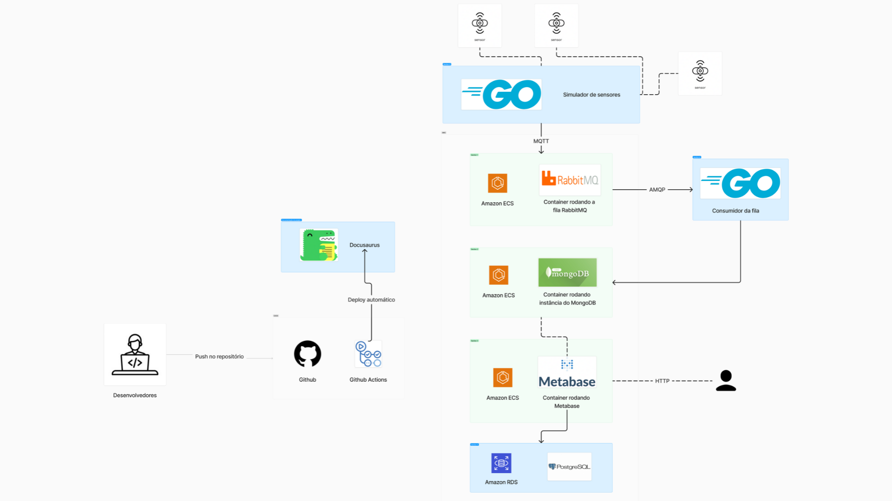

# Descrição da arquitetura



## Visão Geral

Este documento descreve a arquitetura de software para o sistema de IoT desenvolvido, incluindo a simulação de sensores, a comunicação entre dispositivos e o backend, e a interface do usuário. O sistema foi projetado para simular um ambiente IoT com múltiplos sensores e um backend robusto capaz de processar grandes volumes de dados, facilitando a visualização e análise através de uma interface de usuário amigável.

## Componentes da Arquitetura

1. **Sensores (Simulados)**
   - **Tecnologia:** ESP32s
   - **Função:** Geração de dados simulados publicados em tópicos MQTT.

2. **Comunicação**
   - **Broker MQTT:** RabbitMQ
   - **Protocolo:** MQTT para comunicação entre sensores e backend.

3. **Frontend**
   - **Tecnologia:** Metabase
   - **Função:** Visualização de dados através de dashboards interativos.

4. **Backend**
   - **Linguagem:** Go
   - **Função:** Processamento de mensagens e interação com bancos de dados.

5. **Banco de Dados**
    - **PostgreSQL:** Banco de dados relacional usado pelo Metabase.
    - **MongoDB:** Banco de dados NoSQL para armazenamento de dados brutos.

## Sensores

### Simulação de sensores em Go
Os sensores serão simulados no projeto. A sua simulação consiste em basicamente gerar valores que se encontram em seu "range" de atuação e publicá-los em um tópico MQTT.

## Comunicação

### RabbitMQ
RabbitMQ foi escolhido como o broker de mensagens devido à sua robustez, escalabilidade e suporte extensivo ao protocolo MQTT. MQTT é um protocolo leve de mensagens para dispositivos de baixa potência e redes de largura de banda limitada, ideal para IoT. A utilização do RabbitMQ permite gerenciar eficientemente o alto volume de mensagens geradas pelos sensores simulados, garantindo que o sistema possa escalar para suportar milhares de dispositivos simultaneamente sem perda de performance. A escolha de RabbitMQ também se deve à sua capacidade de oferecer qualidade de serviço (QoS) e garantir que as mensagens sejam entregues de forma confiável, mesmo em casos de falhas na rede.

## Frontend

### Metabase
Metabase é uma escolha popular para análise de dados e visualização em tempo real, particularmente útil em ambientes IoT onde a interpretação rápida e eficaz dos dados é crucial. A escolha do Metabase como frontend deve-se à sua capacidade de integrar-se facilmente com diversos tipos de bancos de dados, como PostgreSQL e MongoDB, além de sua facilidade de uso para criar dashboards dinâmicos e interativos sem necessidade de programação avançada.

Metabase permite diversas formas de visualização de dados, incluindo gráficos de linha, barras, dispersão e mapas, essenciais para monitorar e analisar os dados dos sensores em tempo real. A capacidade de filtrar e segmentar dados em tempo real ajuda os usuários a focar em métricas específicas e identificar padrões ou problemas rapidamente.

## Backend

### Go
Go foi escolhida como a linguagem de programação para o backend devido à sua eficiência e performance em ambientes concorrentes. A natureza compilada e a gestão eficiente de múltiplas goroutines (threads leves) permitem que Go processe grandes volumes de dados de forma rápida e segura. No contexto do sistema, Go é utilizado tanto para simular os sensores quanto para consumir e processar os dados recebidos via RabbitMQ. A simulação dos sensores em Go permite gerar dados de telemetria de forma controlada e realística, adequada para testar e validar o comportamento do sistema em diferentes cenários operacionais.

## Banco de Dados

### PostgreSQL
Sistema de gerenciamento de banco de dados relacional do Metabase.

### MongoDB
Foi escolhido o MongoDB, um sistema de gerenciamento de banco de dados NoSQL como banco de dados para armazenamento de dados brutos coletados do sensores. Essa escolha foi motivada pela necessidade de armazenar grandes volumes de dados não estruturados ou semi-estruturados gerados pelos sensores. MongoDB é ideal para cenários onde a estrutura dos dados pode mudar com o tempo, como é comum em projetos de IoT. Além disso, sua capacidade de escalar horizontalmente e distribuir dados geograficamente oferece flexibilidade e melhora o desempenho, essencial para a análise de dados em tempo real e para responder de maneira ágil a consultas complexas.

## Arquitetura Detalhada

```plaintext
[Sensores (ESP32s simulados)] --MQTT--> [Broker (RabbitMQ)] --AMQP--> [Backend (Go)]  [Frontend (Metabase)]
                                                                          |                 ^       | 
                                                                          v                 |       v
                                                                            [MongoDB (NoSQL)]    [Banco de Dados (PostgreSQL)]
```

## Fluxo de Dados
Para uma compreensão detalhada do fluxo de dados dentro do sistema de IoT proposto, vamos descrever cada etapa, desde a geração de dados pelos sensores simulados até a visualização de dados no frontend, explicando os processos intermediários e as tecnologias envolvidas:

### 1. Geração de Dados pelos Sensores Simulados
- **Sensores Simulados (ESP32s)**: Utilizando a plataforma de simulação de sensores, valores de sensoriamento são gerados programaticamente. Estes valores podem representar diferentes tipos de dados ambientais ou operacionais, como temperatura, umidade, pressão, etc.
- **Publicação MQTT**: Os dados gerados são encapsulados em mensagens MQTT e publicados em tópicos específicos. O MQTT é escolhido devido à sua eficiência em redes com largura de banda limitada e sua capacidade de entregar mensagens de forma leve e confiável.

### 2. Recebimento e Enfileiramento das Mensagens
- **RabbitMQ como Broker MQTT**: Após a publicação, as mensagens são recebidas pelo RabbitMQ, que atua como um broker MQTT. RabbitMQ é responsável por enfileirar as mensagens recebidas e gerenciar a distribuição dessas mensagens para os consumidores downstream, garantindo robustez e escalabilidade no tratamento de grandes volumes de dados.

### 3. Consumo e Processamento dos Dados
- **Backend em Go**: O backend desenvolvido em Go se inscreve nos tópicos apropriados do RabbitMQ e consome as mensagens enfileiradas. Go é escolhida por sua eficiência em gerenciar alta concorrência e por sua performance em ambientes de rede.
- **Processamento de Dados**: Uma vez recebidos, os dados são deserializados e podem passar por uma série de operações de processamento como validação, agregação, ou transformações baseadas em regras de negócios. Este processamento é essencial para preparar os dados para armazenamento eficiente e análise subsequente.

### 4. Armazenamento de Dados
- **MongoDB (Banco de Dados NoSQL)**: Dados dos sensores são armazenados em MongoDB. Este banco de dados é escolhido pela sua flexibilidade em lidar com esquemas variáveis e pela sua escalabilidade horizontal, que é ideal para lidar com grandes volumes de dados não estruturados.

### 5. Visualização de Dados
- **Metabase**: Esta ferramenta de visualização acessa os dados armazenados no PostgreSQL para criar visualizações interativas e dashboards. Os usuários finais podem visualizar e analisar os dados através de gráficos, tabelas e outros widgets, facilitando a interpretação e a tomada de decisão baseada em dados em tempo real.

### Conclusão do Fluxo de Dados
Esse fluxo completo garante que o sistema não apenas colete e armazene grandes volumes de dados de maneira eficiente, mas também que transforme esses dados em insights acionáveis por meio de visualizações compreensíveis. O sistema é projetado para ser robusto e escalável, suportando o aumento da carga de dados sem degradação de desempenho, essencial para ambientes de IoT dinâmicos e em constante expansão.

## Considerações Finais

A arquitetura deste sistema de IoT foi meticulosamente projetada para garantir escalabilidade, robustez e eficiência, permitindo o gerenciamento efetivo de grandes volumes de dados e numerosos dispositivos simultaneamente. Com componentes como RabbitMQ e MongoDB, o sistema não apenas suporta o crescimento sem comprometer o desempenho, mas também assegura a integridade e segurança dos dados em tempo real. Além disso, a interface do usuário, impulsionada pelo Metabase, oferece uma experiência reativa e intuitiva, permitindo análises detalhadas e a tomada de decisão baseada em insights precisos. Essas características fazem desta arquitetura uma solução robusta e adaptável, ideal para ambientes de IoT dinâmicos e em constante evolução.