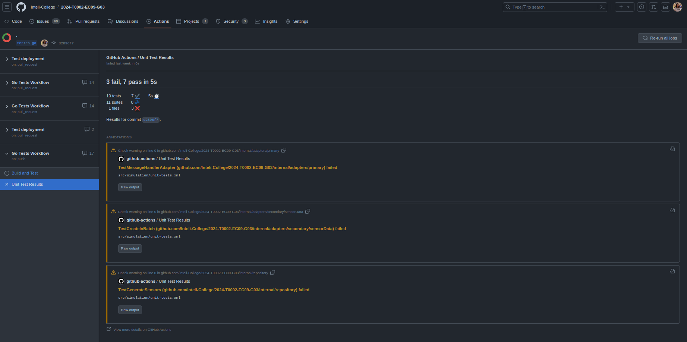

# Automatização de Testes no GitHub Actions

**Esse worflow não está presente no projeto, pois foi removido SEM AUTORIZAÇÃO E SEM COMUNICAR QUEM FEZ no commit no [#128](https://github.com/Inteli-College/2024-T0002-EC09-G03/commit/31b2e0a7fb39ccfdb928f0d414ff5fe796f5a347) da pull request https://github.com/Inteli-College/2024-T0002-EC09-G03/pull/128**

Esse documento detalha a automatização feita para testes em Go utilizando o GitHub Actions e outras ferramentas mencionadas abaixo. 

## Configuração Inicial e Ambiente
O workflow é acionado por eventos de ```push``` e ```pull_request```, garantindo que cada alteração no código ou nova solicitação de pull seja validada. O job ```build-and-test``` engloba as seguintes configurações chave:

- **Checkout do Código e Docker:** Inicialmente, o código é extraído para o ambiente de execução. Em seguida, o Docker Buildx é configurado, permitindo o uso de Docker e Docker Compose para gerenciar contêineres que podem ser necessários para o ambiente de testes, como bancos de dados, RabbitMQ e outros serviços.

- **Ambiente Go e Variáveis:** A versão desejada do Go é configurada, e variáveis de ambiente são estabelecidas para garantir que os testes tenham todas as informações necessárias, como credenciais de acesso a serviços externos.

## Execução de Testes
A execução dos testes é dividida em etapas focadas na preparação e na execução propriamente dita:

- **Preparação do Ambiente de Testes:** Os serviços definidos em ```docker-compose.yml``` são iniciados para simular o ambiente de produção o mais próximo possível. Isso inclui, por exemplo, iniciar instâncias de bancos de dados ou message brokers.

- **Configuração e Execução:** Com o ambiente preparado, a ferramenta ```gotestsum``` (igual a go test) é instalada para melhorar a legibilidade e o gerenciamento dos logs de testes. Em seguida, os testes são executados dentro do diretório especificado, gerando um arquivo JUnit XML. Este arquivo é crucial para a análise automatizada dos resultados dos testes.

## Análise e Publicação dos Resultados
Após a execução dos testes, os resultados são publicados diretamente na pull request correspondente, utilizando a ação ```publish-unit-test-result-action```. Isso fornece um feedback imediato sobre o sucesso ou falha dos testes, incluindo detalhes como o número de testes passados, falhados e a duração total dos testes.

## Finalização
Ao final, os serviços iniciados por Docker Compose são encerrados, garantindo que o ambiente de teste seja limpo após a conclusão dos testes. Esta etapa é crucial para evitar conflitos ou consumo desnecessário de recursos.

# Resultados dos Testes
O resultado final mostra uma mistura de testes passados e falhados, com um total de 10 testes realizados e 3 falhas detectadas. As falhas destacadas indicam problemas específicos como autenticação não autorizada em comandos de banco de dados e erros ao tentar acessar documentos no MongoDB.



## Testes com Falhas

As falhas nos testes mostram problemas específicos na lógica dos testes. Abaixo estão detalhadas cada um desses erros e suas possívis causas:

### Falha no ```TestMessageHandlerAdapter```
**Erro:** O teste falha ao tentar recuperar uma mensagem processada do MongoDB, esperando um resultado nulo (nil) mas recebendo uma mensagem de erro indicando "mongo: no documents in result". Além disso, o teste espera que o resultado não seja vazio, mas obtém um mapa vazio.

**Causas Possíveis:**

- **Dados de Teste Ausentes:** Não há documentos no MongoDB correspondentes aos critérios da consulta utilizada pelo teste. Isso pode ser causado por uma falha na preparação do teste, onde os dados esperados não foram inseridos no banco antes da execução do teste.

### Falha no ```TestCreateInBatch```
**Erro:** Durante a tentativa de criar dados em lote, o teste encontra uma falha de autenticação com o erro "(Unauthorized) Command insert requires authentication". Um erro similar é encontrado ao tentar encontrar os dados inseridos, com o erro "(Unauthorized) Command find requires authentication".

**Causas Possíveis:**

- **Nome da collection inválida:** A collection do MongoDB que está sendo buscada pode não existir, causando um erro de autenticação. 

### Falha no ```TestGenerateSensors```
**Erro:** O teste TestGenerateSensors resulta em um pânico devido a uma referência de memória nula, indicado pelo erro de "runtime error: invalid memory address or nil pointer dereference".

**Causas Possíveis:**

- **Referência Nula:** Alguma parte do código tenta acessar ou modificar uma variável ou objeto que não foi devidamente iniciada no código, resultando em um acesso a um endereço de memória inválido.

### Análise e Soluções para Falhas
Cada um dos erros descritos precisam de uma revisão dos códigos envolvidos nos testes e as suas lógicas.

- **Preparar Adequadamente os Dados dos Testes:** Assegurar que todos os dados necessários para os testes sejam inseridos no banco de dados correto pelo testes, antes de executar a lógica.
- **Revisão de código:** Verificar se a lógica do código está correta e citação de credenciais do ambiente. 


