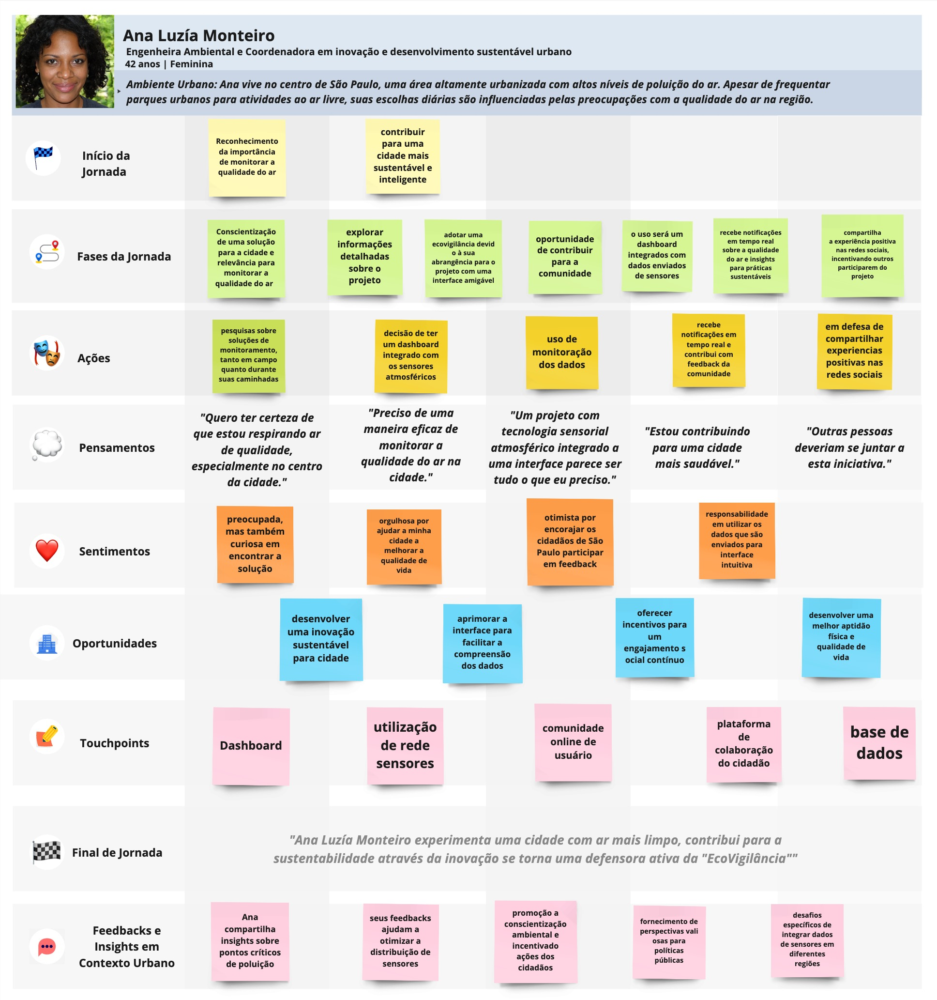

# Mapa de jornada do usuário

A seguir, você encontrará uma representação visual detalhada que ilustra o percurso diário de Ana, que vive no centro de São Paulo e está imersa em um ambiente urbanizado com altos níveis de poluição do ar. Apesar de enfrentar as dificuldades diárias impostas por esse cenário, Ana busca ativamente soluções que não só melhorem sua qualidade de vida, mas também a da comunidade ao seu redor.

Esta jornada do usuário foi meticulosamente mapeada para oferecer insights sobre as motivações, ações, pensamentos e sentimentos de Ana ao longo de seu dia. O mapa destaca as fases pelas quais ela passa, desde a conscientização inicial sobre os problemas ambientais até as ações proativas para combatê-los. Também enfatiza as oportunidades de melhoria na qualidade do ar que Ana identifica e as soluções inovadoras que ela implementa, usando a tecnologia para criar um impacto positivo.

