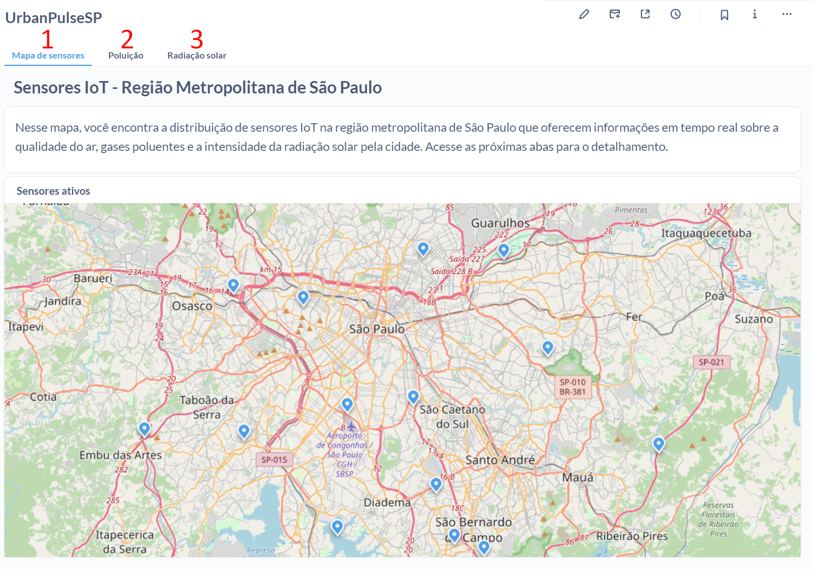
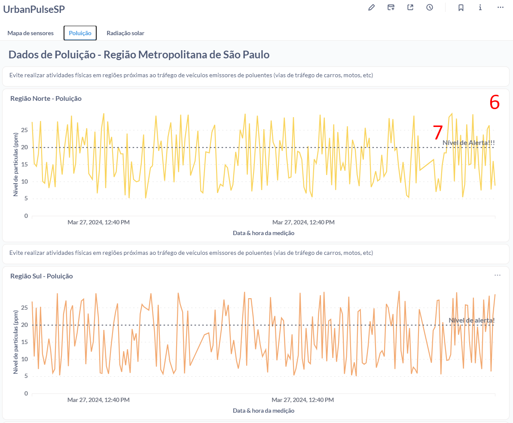
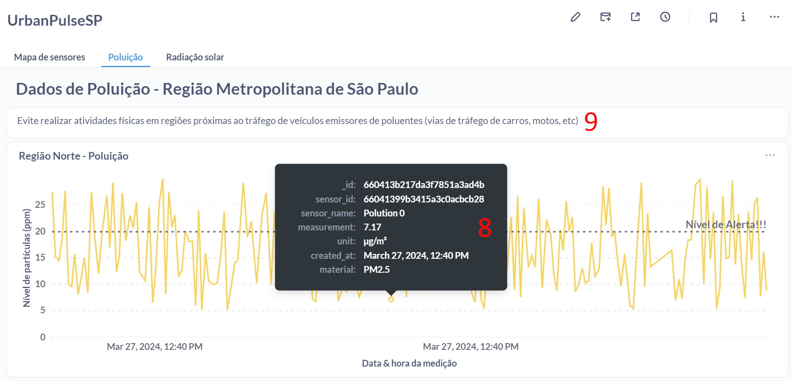
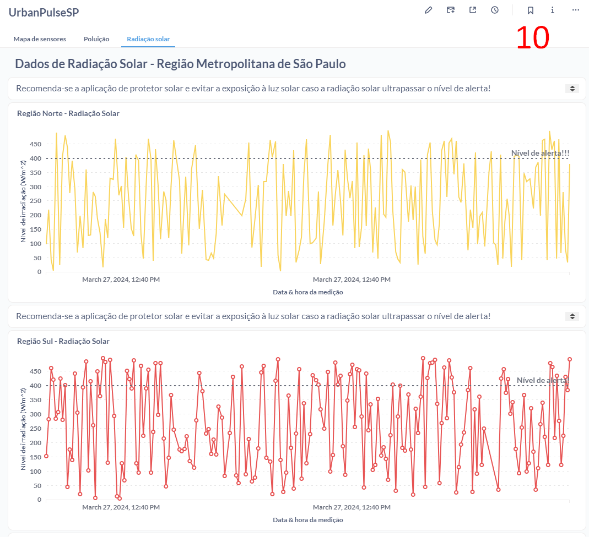

# Dashboard Urban Sense

Para gerenciar a visualização dos sensores IoT foi escolhido o Metabase  como plataforma de design e exibição gráfica. Com ele, foi possível gerar uma visão detalhada da distribuição geográfica desses dispositivos IoT e dos dados que estão sendo adquiridos.

Ao dividir os dados em três abas fundamentais, o Dashboard Urban Sense no Metabase oferece uma visão abrangente e contextualizada da distribuição geográfica dos sensores e do processamento de seus dados por região. 

A primeira aba (1) apresenta um mapa interativo, permitindo aos usuários visualizarem a localização precisa dos sensores, bem como as informações específicas de cada um, como coordenadas geográficas, tipo de sensor e dados ambientais em tempo real.

Nesse mapa de distribuição geográfica, é possível aproximar e afastar regiões (4) e ao colocar o mouse em cima do símbolo de um sensor (5) é possível visualizar seu nome e coordenadas.

A segunda seção do dashboard (2) é dedicada aos gráficos dos sensores de poluição, segmentados em quatro regiões-chave da cidade: Norte, Sul, Leste e Oeste.

Esses gráficos não apenas exibem a moda dos dados dos sensores em cada região ao longo do tempo (6), mas também estabelecem um limiar de alerta (7) para o índice máximo de poluição aceitável. Ao se colocar o mouse em cima de algum ponto da série temporal do gráfico (8), é possível ver o detalhamento do id do sensor que coletou aquele dado, bem como seu nome, o valor numérico da medição, bem como sua unidade de medida, a data, hora e minuto. Além disso, uma mensagem proativa é exibida acima de cada gráfico (9), fornecendo recomendações diretas caso o nível do sensor ultrapasse esse limiar, promovendo assim a conscientização e ações para melhorar a qualidade do ar na cidade.

A terceira aba do Metabase (3) aborda os dados de radiação solar, seguindo uma abordagem semelhante à dos sensores de poluição, com gráficos (10) que mostram a moda dos dados de radiação solar em diferentes regiões. Novamente, há um limiar de alerta e mensagens de recomendação para proteger os cidadãos dos efeitos nocivos da exposição excessiva à radiação solar.

O dashboard de visualização e processamento dos sensores IoT Urban Sense, desenvolvido para a PRODAM, representa um avanço significativo na estratégia tecnológica da empresa. Alinhado com sua missão de construir uma cidade mais conectada, inteligente e humana, este dashboard oferece uma visão abrangente e acessível dos dados ambientais coletados em São Paulo.

Ao integrar os dados dos sensores IoT Urban Sense em um formato claro e intuitivo, o dashboard permite uma análise eficiente das condições ambientais em tempo real. Isso não apenas facilita a tomada de decisões informadas para gestores municipais, mas também promove a conscientização e ações proativas por parte dos cidadãos.

A interface do dashboard foi projetada para oferecer uma experiência fácil de usar, destacando as informações mais relevantes de maneira clara e concisa. Isso garante que os usuários possam entender rapidamente as tendências e padrões dos dados apresentados, sem a necessidade de uma análise aprofundada.

Com isso, o dashboard de visualização e processamento dos sensores IoT Urban Sense será uma ferramenta valiosa que exemplifica o compromisso da PRODAM com a inovação tecnológica e a melhoria da qualidade de vida na cidade de São Paulo.
